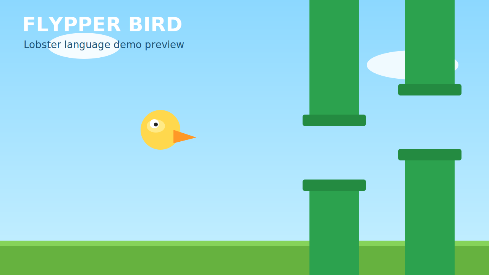

# Flypper Bird (Lobster)

用 [Lobster](https://github.com/aardappel/lobster) 寫的一個簡化版 Flappy Bird clone。



## 檔案

- `flypper_bird.lobster`：主程式。
- `assets/preview.svg`：遊戲預覽圖。
- `.github/workflows/release.yml`：CI / Release 流程。

## 玩法

- `Space` 或滑鼠左鍵：拍翅（向上）。
- `Esc`：離開。
- 死亡後按 `Space` 或滑鼠左鍵：重新開始。

## 本機執行

先安裝 Lobster（請參考官方 repo），然後在 Lobster 環境中執行：

```bash
lobster flypper_bird.lobster
```

## GitHub CI / 自動發佈

此 repo 已加入 GitHub Actions：

- PR 時：會自動嘗試 build 打包流程（驗證可建置）。
- `push` tag（例如 `v1.0.0`）時：自動建置並上傳 Linux bundle 到 GitHub Release。
- `workflow_dispatch` 時：可手動指定 tag 發佈。

Release 內容包含：

- `flypper-bird-linux-x86_64.tar.gz`
  - `flypper-bird`（Lobster runtime，可直接搭配 pak 執行）
  - `default.lpak`（遊戲程式包）
  - `data/shaders`（執行所需 shader）
  - `preview.svg`

## 遊戲內容

- 重力 + 單鍵拍翅手感
- 持續捲動水管與碰撞判定
- 計分與最佳分數（用畫面上的點表示）
